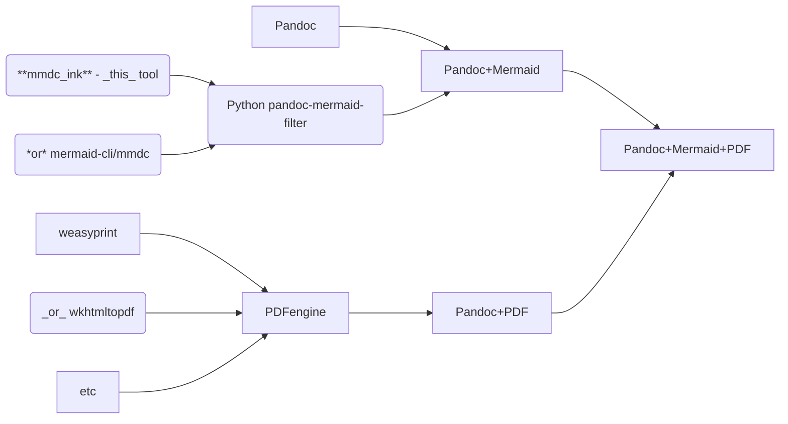

# mermaid-ink-cli

[mermaid-ink-cli / mmdc_ink](https://github.com/clach04/mermaid-ink-cli) is a [mermaid.ink](https://github.com/jihchi/mermaid.ink) cli client, with command line arguments similar to [mermaid-cli / mmdc](https://github.com/mermaid-js/mermaid-cli)
For more infomation about Mermaid/mermaid.js see https://mermaid.js.org/intro/

Windows binaries maybe available from https://github.com/clach04/mermaid-ink-cli/releases
Windows binaries for mermaid filter available from [clach04 fork pandoc-mermaid-filter](https://github.com/clach04/pandoc-mermaid-filter/releases/tag/20250521)

mmdc_ink is supports a sub-set of mmdc parameters to convert from Mermaid into SVG, png, webp, or JPEG (jpg) images.

The cURL binary is required, curl is now installed by default for Microsoft Windows 11.

A mermaid.ink server is required, control over the server to use is via the operating system environment variable `MERMAID_INK_URL`. It is recommended to set the root URL, without a trailing slash. Examples:

Linux

    # Assuming bourne/bash compatible shell
    export MERMAID_INK_URL=https://mermaid.ink

Windows

    set MERMAID_INK_URL=https://mermaid.ink

Use the `--verbose` flag to see the URL that will be used.

## Usage

    py -3 mmdc_ink.py -i gantt.mmd -o gantt.svg
    py -3 mmdc_ink.py -i graph.mmd -o graph.svg

See below for a working [Pandoc](https://github.com/jgm/pandoc) sample (using a [third party pandoc filter](https://github.com/clach04/pandoc-mermaid-filter)).

## Building Windows EXE binaries

    pip install pyinstaller
    pyinstaller --onefile mmdc_ink.py

## Pandoc filter

To use with Pandoc, check out https://github.com/timofurrer/pandoc-mermaid-filter - or my fork with some Windows notes https://github.com/clach04/pandoc-mermaid-filter
Follow pandoc-mermaid-filter instructions, to get a "binary" built (whether thats and executable python script under Linux, or a Microsoft Windows binary .exe).
Then override the Mermaid command line binary to the filter.

Either override for the current session, or single run.

### Windows

    REM change below to patch your path
    set MERMAID_BIN=C:\code\py\mermaid-ink-cli\dist\mmdc_ink.exe
    set MERMAID_BIN=dist\mmdc_ink.exe

### Linux / Unix

    export MERMAID_BIN=mmdc_ink

### Pandoc sample

    pandoc README.md -o sample.html --filter pandoc-mermaid
    pandoc README.md -o sample.html --filter pandoc-mermaid -w html5 --metadata pagetitle="Sample"

    pandoc README.md -o sample.html --embed-resources --standalone --filter pandoc-mermaid
    pandoc README.md -o sample.html --embed-resources --standalone --filter pandoc-mermaid -w html5 --metadata pagetitle="Sample"

NOTE1 html will use SVG, html5 will use PNG (this is likely a bug/limitation of pandoc-mermaid - **TODO** determine for sure).
NOTE2 html image will likely be too large, html5 with png looks reasonable

    # Assuming PDF render/engine already installed and in the path - may need to use --pdf-engine
    # Windows binaries for weasyprint available at https://github.com/Kozea/WeasyPrint
    pandoc README.md -o sample.pdf --filter pandoc-mermaid -w html5 --metadata pagetitle="Sample"
    pandoc README.md -o sample.pdf --filter pandoc-mermaid -w html5 --metadata pagetitle="Sample" --pdf-engine weasyprint

I've not had much success with other filters as per Timo's readme comment.
https://github.com/pandoc-ext/diagram partially works, svg's get exported but they are missing from the final html :-(

### Pandoc and PDF notes

Display options for outputing PDF:

    > pandoc --pdf-engine --help
    Argument of --pdf-engine must be one of wkhtmltopdf, weasyprint, pagedjs-cli, prince, pdflatex, lualatex, xelatex, latexmk, tectonic, pdfroff, typst, context

## Mermaid Examples

### Mermaid Example - Graph

### Mermaid Example - Graph Pandoc Dependencies

